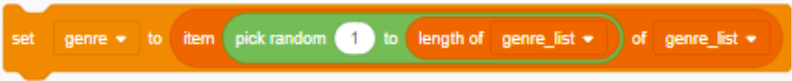

## Collect song data

This whole stage of the quest is just about listening to music!

Now that you’ve created your labelling program for your machine learning model in Scratch, you can start labelling tracks and creating training data for the model.

The more music you classify, the better your machine learning model will be at choosing music your user will like. 
Take your time in this session to listen to and label lots of music, making sure you change your search from time to time to include all the genres for each class (and maybe add some new ones you come across!)

### Classifying more music
Our Scratch labelling application searches the song database and returns random songs in a specific style of music or genre. This is because the catalogue of music available to us is so huge and varied that if you returned something totally random, you would be hearing samples of things like podcasts and audiobooks as well!

A good way to build a wide sample of music data is to change genre from time to time while you are classifying music. 

Don’t forget you can change genre by clicking the green flag and entering a new value for genre at the prompt. Remember to change this every so often to cover all the genres you listed in the earlier stages of the quest.

--- collapse ---
---
title: Pro move - Create a list of genres and choose a random one each time
---

`Create a List` in the `Variables`{:class="block3variables"} menu called `genre list` which contains all the genres you want to search.  

Once you have a list of genres, you can use it to automatically set a random genre each time the application searches the music database.  

When you set the genre for your search in your main script, you can use this combination of blocks to instead to set a random genre from your list:

--- /collapse ---

