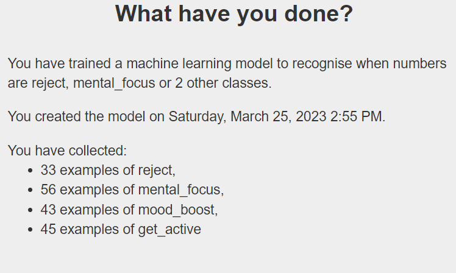

## Train the model with your data

Now that you have added training data to your model, you have to train it on that data.

When you train a machine learning model on your collected song data, we mean that you are programming a computer on the internet to be able to look at a large amount of information about different songs and learn from it.

The computer doesn't actually "listen" to the songs like we do, but instead it uses special algorithms and maths to analyse the data about the songs, like the tempo, the ‘happiness’ and the ‘danceability’.

By processing all of this information, the machine learning model can start to recognise patterns in the songs and make predictions about them. For example, it might learn that songs with a fast tempo and a lot of high notes tend to be ‘happy’, while songs with a slower tempo and lower notes tend to be ‘sad’.

Once the machine learning model has been trained on a lot of song data, we can use it to predict things about new songs that it hasn't heard before, like whether they are likely to be happy or sad.

--- task ---

Open the website [Machine Learning for Kids](https://machinelearningforkids.co.uk/#!/login).

--- /task ---

--- task ---

In the screen that appears, choose **Log In**. Enter your username and password on the next screen.

--- /task ---

--- task ---

Select Go to your Projects.

--- /task ---

--- task ---

On your projects page, select the model you want to train.

--- /task ---

--- task ---

Select Learn & Test.

--- /task ---

Your model will now train on the data you have provided. If you add more data to the model, you will need to train it again to make sure the new data is included in the model when it makes predictions.

Once your model has been trained, Machine learning for kids will give you some information about how many data samples you have collected for each class, as well as the date and time you most recently trained the model.

